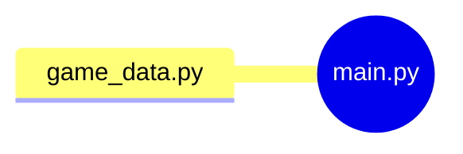

# Higher Lower Game Project (Day 14)

In this day I applied all the learned topis from day 1 to day 13.

## Project of the day

**Higher Lower Game**

## Project Structure:



1. Run the script:

```bash
    python main.py
```

[Go Back](../README.md)