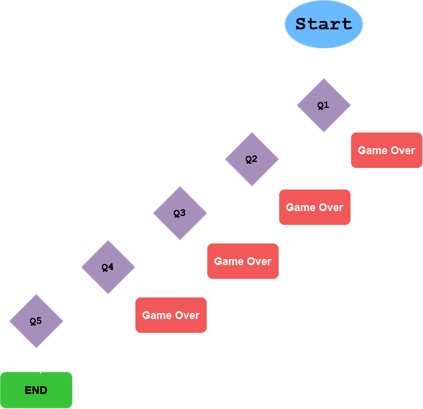

# Day 3

## Objectives

In this day I learned about:

-   Conditional statements
-   Logical operators
-   Code blocks
-   Scope

## Project of the day

**Text Adventure**
Diagram of the text adventure:


2. Run the script:

```bash
    python text_adventure.py
```

[Go to Home](../README.md)
