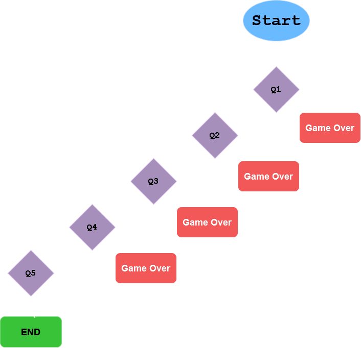

# Control Flow and Logical Operators (Day 3)

## Objectives

In this day I learned about:

-   Conditional statements
-   Logical operators
-   Code blocks
-   Scope

## Practice

1. Leap year

## Project of the day

1. Text Adventure
Diagram of the text adventure:


- Run the script:

```bash
    python text_adventure.py
```

[Go to Home](../README.md)
