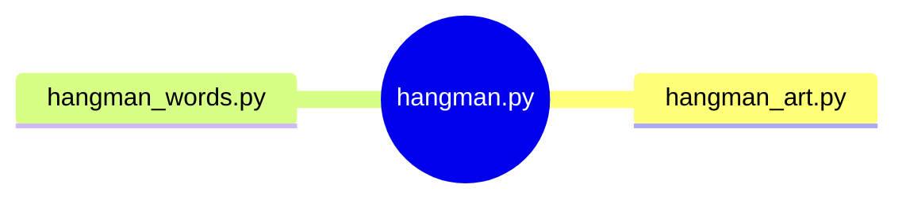

# Day 7

## Objectives

In this day I applied all the learbed topics in the past week such as:

-   `print()` Function
-   Commenting
-   Debbuging
-   String Manipulation
-   Variables
-   Data types
-   f-String
-   Conditional statements
-   Logical operators
-   Code blocks
-   Scope
-   Python lists
-   `for` & `while` Loops
-   Functions
-   Range
-   Code blocks

## Project of the day

**Hangman**

For this project i decided go further aplying the conde in three files and using funcitions:



Also I added some additional features to enhance the game:

-   Implementing a graphical representation of the hangman.
-   Adding a difficulty level with different word lengths or limited attempts.

2. Run the script:

```bash
    python hangman.py
```

[Go to Home](../README.md)
