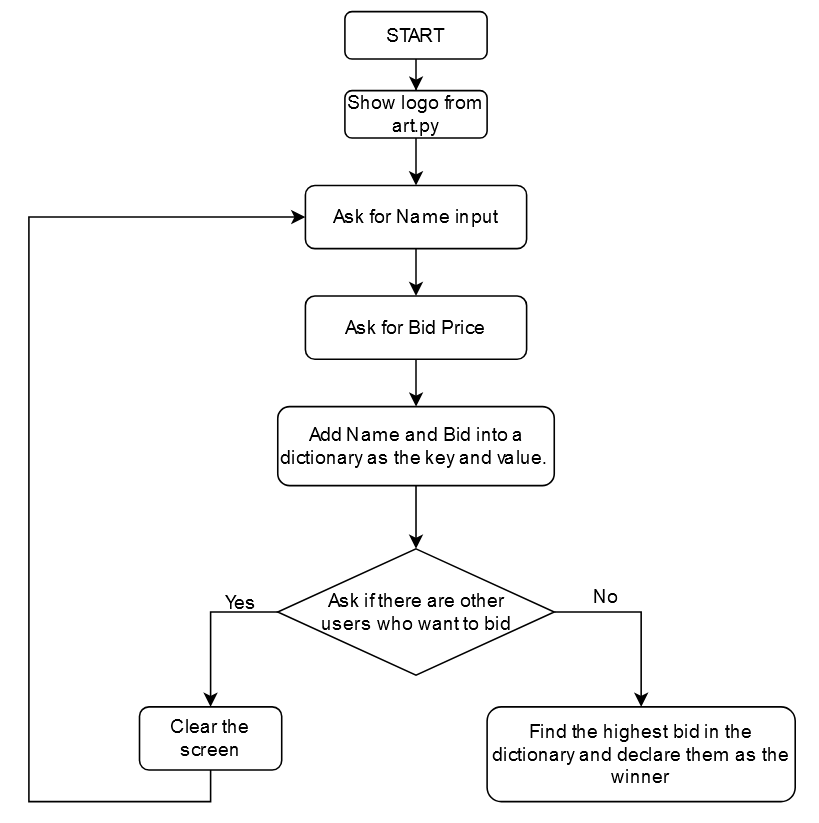

# Day 9

## Objectives

In this day I learned about:

-   Dictionaries
-   Nesting

## Project of the day

**Blind Auction**



1. Run the script:

```bash
    python blind_auction.py
```

[Go to Home](../README.md)
